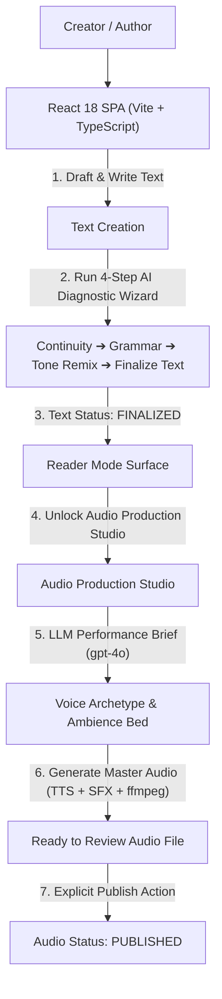

# PocketVerse — Serialized Story AI Command Center

> **PocketVerse** is an end-to-end Tech-Noir web application designed for serialized fiction authors, audio drama showrunners, and web-fiction writers. It enables creators to write, organize multi-episode series, execute guided 4-step AI continuity and character reviews, and produce directed audio drama episodes using OpenAI (`gpt-4o`) and ElevenLabs TTS/SFX before publishing.

---

## 📐 System Architecture & Workflow

PocketVerse is built with a decoupled monorepo architecture: a React 18 single-page app on the frontend, an Express REST API backend, an embedded SQLite database, server-side OpenAI integration, and an ElevenLabs + `ffmpeg` Audio Production Studio.



---

## 🎬 Two-Stage Production Lifecycle

### Stage 1: Text Script Creation & AI Diagnostics (Text First)
1. **Drafting**: Creator writes or pastes an episode manuscript.
2. **4-Step AI Diagnostic Wizard**:
   - **Step 1 (Continuity & Hook)**: OpenAI `gpt-4o` checks plot holes, character motivations, Episode N-1 continuity, and rates the ending cliffhanger (1–10). Includes an inline drawer to edit Episode N-1.
   - **Step 2 (Grammar & Audio Pacing)**: OpenAI `gpt-4o-mini` scans for copyediting fixes and speech cadence adjustments with 1-click accept toggles.
   - **Step 3 (Tone / Genre Remix)**: OpenAI `gpt-4o` improvises the manuscript into **Noir, Cyberpunk, Horror, Comedy, Drama, or Sci-Fi** while strictly preserving plot beats and continuity.
   - **Step 4 (Save & Publish Text)**: Finalizes the manuscript text and updates status to `FINALIZED`.

### Stage 2: Audio Production Studio (After Text Finalization)
Once an episode is `FINALIZED`, the **Convert to Audio / Audio Studio** engine unlocks:
1. **Audio Direction Step (LLM Call)**: Calls OpenAI `gpt-4o` with a 20+ year veteran technical audio director persona. Reads the finalized script and tone category to produce a structured Performance Brief (`voice_id`, `voice_settings`, `pacing_notes`, `ambience_description`, `ambience_volume_db`).
2. **Audio Generation**: Calls ElevenLabs TTS + Sound Effects API and executes a server-side `ffmpeg` filter complex to duck background ambience under narration at volume dB.
3. **Review & Edit**: Audio status updates to `ready_to_review`. The creator can play the master audio track and edit performance brief parameters (voice, settings, ambience description, volume slider) to re-generate.
4. **Explicit Audio Publishing**: Clicking **"Publish Audio Episode"** is an explicit, separate action (`POST /api/episodes/:id/audio/publish`) that updates status to `published` and records `published_at`. Generating audio **never** auto-publishes.

---

## 🎨 Tech-Noir Design System

PocketVerse uses a custom-built Tech-Noir design system implemented in pure CSS ([main.css](file:///home/chethan/Hackathon/pocketverse/frontend/src/styles/main.css)):

- **Void Background**: `#0B0708` deep dark surface with fixed background grid overlay (`linear-gradient(rgba(217, 30, 54, 0.03))`).
- **Panel Surface**: `#150F10` dark containers and `#1F1718` elevated cards with 1px subtle borders.
- **Red Halo Glow**: Primary accent `#D91E36` with radial glows (`rgba(217, 30, 54, 0.35)`).
- **Typography**: Google Fonts — `Archivo Black` & `Space Grotesk` for all-caps grotesk headers, `Inter` for body text.
- **1px Status Pills**: Pill badges for episode text and audio statuses:
  - Text Status: `Draft`, `Analyzed`, `Finalized`
  - Audio Status: `Text Pending` (un-finalized), `No Audio`, `Generating Audio`, `Ready to Review`, `Published Audio`
- **Custom Red-on-Black Scrollbar**: Custom `::-webkit-scrollbar` with `#5A1620` thumb, `#D91E36` glowing hover, and `#0B0708` track.

---

## 🗄️ Database Schema (SQLite)

Located in [schema.ts](file:///home/chethan/Hackathon/pocketverse/backend/src/db/schema.ts):

### `episodes` Table
| Column | Type | Description |
| :--- | :--- | :--- |
| `id` | TEXT (PK) | UUID primary key |
| `series_id` | TEXT (FK) | References `series(id)` |
| `episode_number`| INTEGER | Order sequence (1, 2, 3...) |
| `title` | TEXT | Episode title |
| `content` | TEXT | Episode manuscript text |
| `status` | TEXT | `draft` \| `analyzed` \| `finalized` |
| `audio_status` | TEXT | `none` \| `generating` \| `ready_to_review` \| `published` |
| `published_at` | DATETIME | Audio publish timestamp |
| `created_at` | DATETIME | Timestamp |
| `updated_at` | DATETIME | Timestamp |

### `audio_renders` Table
| Column | Type | Description |
| :--- | :--- | :--- |
| `id` | TEXT (PK) | UUID primary key |
| `episode_id` | TEXT (FK) | References `episodes(id)` |
| `performance_brief`| TEXT (JSON) | Directed voice settings, pacing notes, ambience bed & volume dB |
| `voice_id` | TEXT | ElevenLabs voice ID or archetype |
| `audio_url` | TEXT | Path to generated audio master file (`/audio/render-{id}.mp3`) |
| `duration_seconds` | REAL | Duration in seconds |
| `status` | TEXT | `generating` \| `ready` \| `failed` |
| `created_at` | DATETIME | Timestamp |

---

## 📡 REST API Endpoint Specifications

All endpoints run on `http://127.0.0.1:5000/api`:

### Series & Episode Endpoints
- `GET /api/series`: Fetch series list
- `POST /api/series`: Create series
- `GET /api/series/:id`: Fetch series with episodes
- `POST /api/series/:seriesId/episodes`: Create episode
- `GET /api/episodes/:id`: Fetch episode details
- `PUT /api/episodes/:id`: Update title/content
- `DELETE /api/episodes/:id`: Delete episode

### AI Text Diagnostic Endpoints
- `POST /api/episodes/:id/analysis/continuity`: Step 1 Continuity check against Episode N-1
- `POST /api/episodes/:id/analysis/grammar`: Step 2 Copyediting pass
- `POST /api/episodes/:id/analysis/tone`: Step 3 Genre Remix (`Noir`, `Cyberpunk`, `Horror`, `Funny`, `Drama`, `Sci-Fi`)
- `POST /api/episodes/:id/analysis/save`: Step 4 Finalize text script

### Audio Production Endpoints
- `POST /api/episodes/:id/audio/direction`: Generate LLM Performance Brief
- `POST /api/episodes/:id/audio/generate`: Render master audio (TTS + SFX + ffmpeg mix) ➔ sets `audio_status` to `ready_to_review`
- `GET /api/episodes/:id/audio`: Fetch current audio render & status
- `POST /api/episodes/:id/audio/publish`: Explicit publish action ➔ sets `audio_status` to `published`

---

## 🚀 Quickstart

Run the complete stack with a single command:
```bash
./start.sh
```

- **Frontend**: [http://localhost:3000/](http://localhost:3000/)
- **Backend API**: `http://127.0.0.1:5000`
