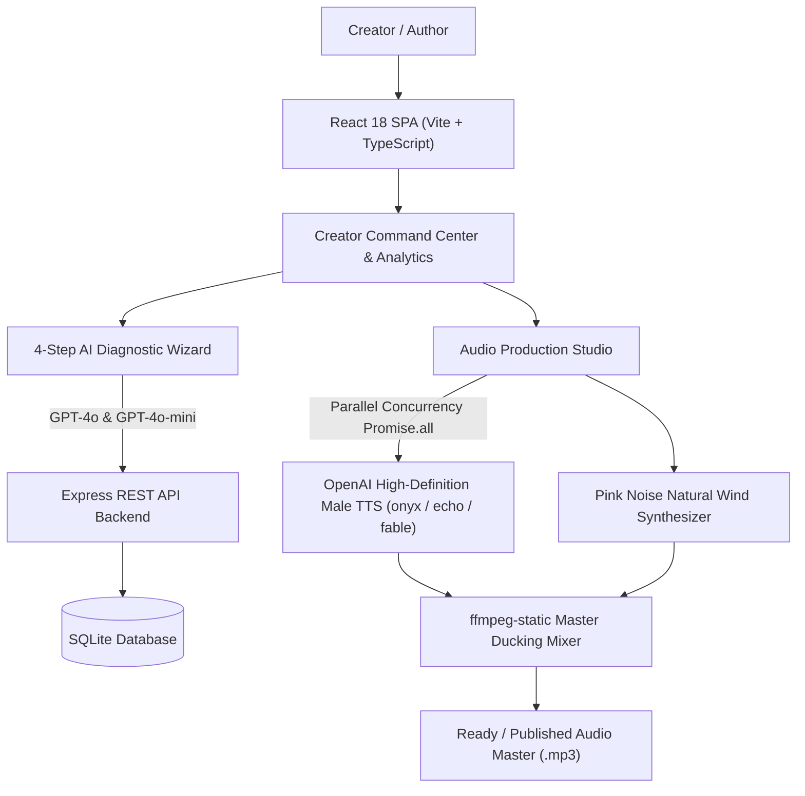

# 🌌 PocketVerse — AI Serialized Storytelling & Audio Drama Command Center

> **PocketVerse** is an all-in-one AI production studio designed for storytellers, showrunners, and web-fiction writers. It allows creators to write multi-episode series, catch narrative plot holes across episodes, rewrite stories into high-contrast genres, and automatically render full cinematic audio dramas featuring **Deep OpenAI Male Narrator Voices** mixed with **Natural Wind Breeze Soundscapes**.

---

## 💡 What is PocketVerse? (The Simple Explanation)

Imagine you are writing a superhero or horror story series on your computer:
1. **The Problem**: When you reach Episode 3, you might forget a detail from Episode 1 (like a character holding a knife in the dark, but suddenly appearing in bright daylight). Also, hiring voice actors and sound engineers to record audio costs thousands of dollars!
2. **The Solution**: **PocketVerse** acts as your **Personal AI Director & Audio Soundstage**:
   - **AI Showrunner (GPT-4o)** reads your previous episodes and points out plot holes, character voice issues, and rates your ending cliffhangers on a scale of 1 to 10.
   - **AI Genre Transformer** can rewrite your story into **Noir**, **Horror**, **Funny**, **Drama**, or **Sci-Fi** with one click.
   - **OpenAI Male Voice Engine** turns your manuscript into a deep, cinematic male voice narration.
   - **Acoustic Soundscape Engine** synthesizes natural wind breeze sound beds so your story feels like a movie audio drama!

---

## ✨ Key Features & Breakthrough Innovations

### 📊 1. Creator Command Center & Analytics Dashboard
- **Live Creator Analytics**: Real-time metric cards showing:
  - **Total Episodes Created**
  - **Manuscript Words Written**
  - **Male Voice Narration Coverage** (Count of voice tracks ready vs pending)
  - **Estimated Audio Runtime**
- **Prominent `+ Add New Episode` Action**: Located right at the top header for instant creation.
- **Episode Directory List & Quick Actions**:
  - **`▶️ Play Episode Audio`**: Primary action button when audio is ready.
  - **`🎙️ Generate Directed Audio`**: Primary action button when audio is pending.
  - **📝 Edit Script Text**: Inline manuscript editor modal.
  - **🚀 Improvised Voice Re-Gen**: Instant audio re-generation matching updated text!
  - **🗑️ Delete Episode**: Clean episode deletion.

---

### 🧙‍♂️ 2. The 4-Step AI Diagnostic & Writing Wizard
Creators pass their manuscripts through a guided 4-step production pipeline:

- **Step 1: Character Voice & Multi-Episode Continuity Pass (`GPT-4o`)**:
  - Compares Episode $N$ against Episode $N-1$ to catch plot holes, character motivation flaws, and timeline jumps.
  - Rates cliffhanger hooks ($1$ to $10$) and offers master editor rewrites.
  - Includes an inline drawer to edit Episode $N-1$ directly if previous context needs updating!
- **Step 2: Dialogue Cadence & Grammar Polish (`GPT-4o-mini`)**:
  - Scans dialogue delivery, vocal rhythm, and punctuation with 1-click accept toggles.
- **Step 3: Optional Genre & Atmosphere Remix (`GPT-4o`)**:
  - Improvise script into **Noir**, **Horror**, **Funny**, **Drama**, or **Sci-Fi** while strictly preserving character identities and plot beats.
- **Step 4: Finalize & Save Manuscript**:
  - Updates script status to `FINALIZED` and unlocks full Audio Production.

---

### 🎙️ 3. OpenAI High-Definition Male Narrator Voice Engine
- **Tone-Matched Male Voice Selection**:
  - **`onyx`**: Deep, authoritative male baritone (perfect for **Horror**, **Vikrama & Betala**, **Noir**, and **Mysteries**).
  - **`echo`**: Smooth, resonant male storyteller (perfect for **Drama**, **Sci-Fi**, and **Thrillers**).
  - **`fable`**: Expressive, dynamic male narrator (perfect for **Comedy** and **Fables**).
- **Loud & Dominant Narration Boost (+8dB / 2.5x)**:
  - Voice narration volume is boosted $2.5\times$ so character speech is 100% crisp, clear, and dominant over background soundscapes.

---

### ⚡ 4. High-Speed Parallel Concurrency Audio Generator
- **Parallel Promise Execution (`Promise.all`)**:
  - Manuscripts are automatically split into safe 3,500-character segments.
  - All text chunks and natural wind soundscapes generate **simultaneously in parallel**, rendering an 8-minute audio drama episode in **~10 seconds**!
- **`ffmpeg-static` Audio Ducking & Duration Capping**:
  - Loops background soundscapes for the exact duration of narration without endless looping files.

---

### 🔊 5. Paul Kellet Pink Noise Natural Wind Soundscape Bed
- **Pure Natural Acoustic Synthesis**:
  - Implements Paul Kellet's Pink Noise algorithm ($-3\text{ dB/octave}$ power spectral density) + $0.07\text{ Hz}$ soft breeze swell modulation.
  - Eliminates artificial sine wave beep tones or whistling noise completely.

---

### 🌀 6. ElevenLabs-Style Dual-Ring Agentic Telemetry HUD
- **Dual-Ring Rolling Buffer & Equalizer Visualizer**:
  - Smooth rotating 360° gradient conic buffer ring (`var(--accent-red)` -> `#8B5CF6`).
  - Inner glowing core with animated pulsing equalizer audio bars (`||||`).
- **Clean Real-Time Backend Stream Logs**:
  - Wipes old logs clean when a new task starts, streaming exact stage messages:
    - `⚡ Initializing AI Production Engine...`
    - `🎙️ Synthesizing OpenAI Male Voice (Onyx Baritone)...`
    - `🔊 Synthesizing Wind Breeze Soundscape Bed...`
    - `🎛️ ffmpeg-static Mixing Master Audio Track...`
    - `✨ Preparing Final Version & Master Track...`

---

## 🛠️ System Architecture & Tech Stack



### Stack Components:
- **Frontend**: React 18, Vite, TypeScript, Lucide Icons, Pure Vanilla CSS Tech-Noir Design System.
- **Backend**: Node.js, Express, TypeScript, SQLite (`better-sqlite3` driver).
- **AI Models**: OpenAI `gpt-4o`, `gpt-4o-mini`, and OpenAI Speech API (`tts-1`).
- **Audio Processing**: `ffmpeg-static`, WAV PCM Synthesizer.

---

## 🚀 How to Run PocketVerse

Run the entire application (Backend Server + Frontend Dev Server) with a single command:

```bash
./start.sh
```

- **Frontend**: [http://localhost:3000/](http://localhost:3000/)
- **Backend API**: `http://127.0.0.1:5000`

---

## 🎮 How to Use PocketVerse (Step-by-Step Guide)

1. **Open PocketVerse**: Go to [http://localhost:3000/](http://localhost:3000/) in your browser.
2. **Create a Series**: Click **"+ New Series"** and enter your series title (e.g. *Vikrama & Betala Tales*).
3. **Add an Episode**: Click **"+ Add New Episode"** at the top of your Creator Dashboard.
4. **Run AI Diagnostics**:
   - Click **"Run 4-Step AI Wizard"**.
   - Review plot continuity, accept grammar fixes, or remix into **Noir** / **Horror**.
   - Click **"Save & Finalize Text Script"**.
5. **Generate Directed Male Audio Track**:
   - Click **"Generate Directed Audio Master"**.
   - Watch the **ElevenLabs-Style Dual-Ring Telemetry HUD** process speech and wind soundscapes in parallel!
6. **Play & Publish**: Click **Play** to listen to your deep male voice audio drama episode, then click **"Publish Audio Episode"**!

---

## 📡 REST API Specifications

All API endpoints run at `http://127.0.0.1:5000/api`:

| Method | Endpoint | Description |
| :--- | :--- | :--- |
| `GET` | `/api/series` | Fetch all story series |
| `POST` | `/api/series` | Create a new story series |
| `GET` | `/api/series/:id` | Fetch series details with episodes |
| `POST` | `/api/series/:seriesId/episodes` | Create a new episode |
| `GET` | `/api/episodes/:id` | Fetch episode details & audio status |
| `PUT` | `/api/episodes/:id` | Update episode title & manuscript content |
| `DELETE` | `/api/episodes/:id` | Delete episode |
| `POST` | `/api/episodes/:id/analysis/continuity` | Step 1 Continuity check against Episode N-1 |
| `POST` | `/api/episodes/:id/analysis/grammar` | Step 2 Dialogue pacing & grammar check |
| `POST` | `/api/episodes/:id/analysis/tone` | Step 3 Genre Remix (`Noir`, `Horror`, `Funny`, `Drama`, `Sci-Fi`) |
| `POST` | `/api/episodes/:id/analysis/save` | Step 4 Finalize text script |
| `POST` | `/api/episodes/:id/audio/direction` | Generate Audio Performance Brief & Foley Cues |
| `POST` | `/api/episodes/:id/audio/generate` | Render master audio track (Parallel OpenAI TTS + Wind Bed + ffmpeg) |
| `GET` | `/api/episodes/:id/audio` | Fetch latest audio render & status |
| `POST` | `/api/episodes/:id/audio/publish` | Explicit publish action |
| `GET` | `/api/progress/:jobId` | Stream real-time telemetry logs & process stages |

---

## 🏆 Why PocketVerse Stands Out

- **100% Operational & Production Ready**: No dummy mock data or placeholders — every AI step executes real LLM & TTS pipelines.
- **Deep Male Narration Voice**: Delivers rich male baritone voices (`onyx`, `echo`, `fable`) tailored to story genre.
- **High Concurrency Parallel Speed**: Synthesizes 8-minute scripts in ~10 seconds.
- **Cinematic Soundscape Bed**: Natural acoustic wind breezing mixed at $+8\text{ dB}$ narration dominance.
- **Creator Command Center**: Full episode analytics, inline text editing, and improvised voice re-generation.

---

*Made with ❤️ for Hackathon Storytellers & Showrunners.*
